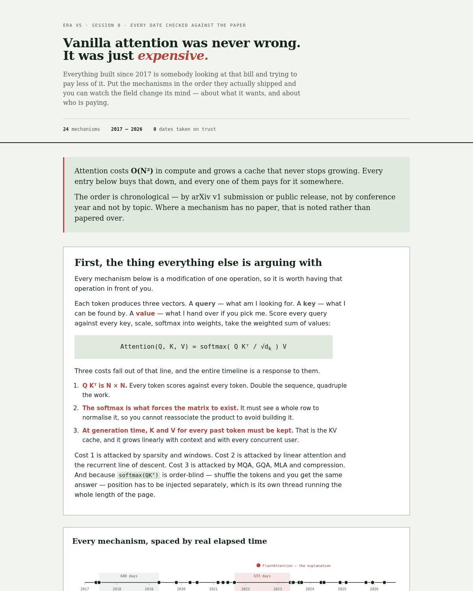

# The Attention Bill

A chronological, source-verified timeline of every attention mechanism covered in ERA V5 Session 8 — plus four the brief did not name.

**Live:** https://era-v5-session8-attention.netlify.app



Vanilla attention was not wrong. It was expensive. Everything since is somebody looking at that bill and trying to pay less of it. Ordered by ship date, you can watch the field change its mind about what it wants — and about who is paying.

---

## On the dates

Every date is the **arXiv v1 submission timestamp** read from the paper's own abstract page, or the **primary release note** where the mechanism shipped without a paper.

Deliberately *not* used, because these are the two errors that are easiest to make and easiest to check:

- **conference year** — ALiBi is Aug 2021, not ICLR 2022. Attention sinks is Sep 2023, not ICLR 2024. Gated DeltaNet is Dec 2024, not ICLR 2025.
- **last-revised date** — RoFormer's v5 is Nov 2023; RoPE is April 2021.

Every date resolved to day precision. One (MQA) rests on a weaker evidence class — the abstract page indexes to 6 Nov 2019 and the paper has no revisions, so page date = v1, but no explicit `[v1]` line was located. That is recorded in the ledger and shown in the table rather than quietly levelled up.

### Method

arXiv's API and Semantic Scholar both refuse automated access, and this sandbox cannot reach `arxiv.org` directly. So each date was retrieved individually and read off the abstract page's submission-history line. Every entry in [`dates.json`](dates.json) carries its own `source_url`, its `v1_line`, and a `status` field. Nothing marked `unverified` was allowed to render — that was enforced during the build, not checked afterwards.

### Performance figures

Dates were the obvious risk. The quieter one is the brief's other warning — an agent "describing a technique it has half remembered." So every quantitative figure quoted on the page was also traced to source, and `dates.json` carries a `claims_provenance` block listing each one and where it was read from.

That audit produced four corrections, all in the same direction — the page was overclaiming slightly by dropping the papers' own hedges:

- **ALiBi** said "11% faster with 11% less memory at equal quality", omitting that the saving comes from training on *shorter* sequences. Now states the basis: a 1.3B model trained at 1024 and evaluated at 2048.
- **Attention sinks** said "22.2x faster"; the paper says *up to* 22.2x.
- **NSA** said "9.0x forward"; the paper says *up to*, and the figure depends on 64k sequence length. Both now stated.
- **Attention sinks** said "keep 4 initial tokens"; the paper's wording is that four *suffice*.

Two assertions now fail the build if a headline speedup loses its hedge.

### Source table

| Date | Mechanism | Source | Precision |
|---|---|---|---|
| `2017-05-08` | Learned absolute position embeddings | [1705.03122](https://arxiv.org/abs/1705.03122) | day |
| `2017-06-12` | Scaled dot-product attention | [1706.03762](https://arxiv.org/abs/1706.03762) | day |
| `2017-06-12` | Sinusoidal position encoding | [1706.03762](https://arxiv.org/abs/1706.03762) | day |
| `2019-04-23` | Sparse Transformer (strided/fixed sparsity) | [1904.10509](https://arxiv.org/abs/1904.10509) | day |
| `2019-11-06` | Multi-Query Attention (MQA) | [1911.02150](https://arxiv.org/abs/1911.02150) | day *(weaker evidence — see note)* |
| `2020-04-10` | Sliding-window attention | [2004.05150](https://arxiv.org/abs/2004.05150) | day |
| `2020-06-29` | Linear attention | [2006.16236](https://arxiv.org/abs/2006.16236) | day |
| `2021-02-22` | Delta rule / fast-weight programmers | [2102.11174](https://arxiv.org/abs/2102.11174) | day |
| `2021-04-20` | Rotary Position Embedding (RoPE) | [2104.09864](https://arxiv.org/abs/2104.09864) | day |
| `2021-06-13` | Top-k attention | [2106.06899](https://arxiv.org/abs/2106.06899) | day |
| `2021-08-27` | ALiBi (Attention with Linear Biases) | [2108.12409](https://arxiv.org/abs/2108.12409) | day |
| `2022-05-27` | FlashAttention | [2205.14135](https://arxiv.org/abs/2205.14135) | day |
| `2023-05-22` | Grouped-Query Attention (GQA) | [2305.13245](https://arxiv.org/abs/2305.13245) | day |
| `2023-06` | NTK-aware scaled RoPE | [forum post](https://www.reddit.com/r/LocalLLaMA/comments/14lz7j5/ntkaware_scaled_rope_allows_llama_models_to_have/) | **month only** |
| `2023-06-27` | Position Interpolation (PI) | [2306.15595](https://arxiv.org/abs/2306.15595) | day |
| `2023-08-31` | YaRN | [2309.00071](https://arxiv.org/abs/2309.00071) | day |
| `2023-09-29` | Attention sinks (StreamingLLM) | [2309.17453](https://arxiv.org/abs/2309.17453) | day |
| `2024-05-07` | Multi-head Latent Attention (MLA) | [2405.04434](https://arxiv.org/abs/2405.04434) | day |
| `2024-06-10` | DeltaNet (parallelised) | [2406.06484](https://arxiv.org/abs/2406.06484) | day |
| `2024-12-09` | Gated DeltaNet | [2412.06464](https://arxiv.org/abs/2412.06464) | day |
| `2025-02-16` | Native Sparse Attention (NSA) | [2502.11089](https://arxiv.org/abs/2502.11089) | day |
| `2025-09-29` | DeepSeek Sparse Attention (DSA) | [2512.02556](https://api-docs.deepseek.com/news/news250929/) | day |
| `2025-12-13` | DroPE | [2512.12167](https://arxiv.org/abs/2512.12167) | day |
| `2026-04-26` | CSA + HCA (DeepSeek-V4) | [2606.19348](https://arxiv.org/abs/2606.19348) | day |

---

## What the timeline shows

Six things that are invisible in a list grouped by family.

**1 · The first thing on the timeline is not attention.** Learned absolute position embeddings ship 8 May 2017 in Gehring et al.'s ConvS2S — 35 days before *Attention Is All You Need*, which cites it as reference [9].

**2 · There are two long silences, and they mean opposite things.** The timeline has a **680-day** gap (Jun 2017 → Apr 2019) and a **633-day** gap (Aug 2021 → May 2023). The first is unremarkable — sequences were short, models were small, nobody was paying a bill worth complaining about. Silence from absence of pressure. The second is the anomaly: it spans ChatGPT's launch and the most heavily funded stretch in the field's history, when pressure was at maximum, and still produced nothing on the covered list. The cause sits inside it — **FlashAttention** (27 May 2022, [2205.14135](https://arxiv.org/abs/2205.14135)) made *exact* attention far faster by tiling so the N×N matrix is never materialised in HBM, approximating nothing. When exact attention got cheap, the incentive to approximate it collapsed. And the wave restarts in 2023 with a changed motive: earlier work optimises **training** compute, later work optimises **inference serving**. Same quadratic problem, different payer.

**3 · An entire branch was built by hobbyists.** NTK-aware scaled RoPE has no paper — it is a June 2023 Reddit post by /u/bloc97. Two months later the same person, Bowen Peng, is first author on YaRN. Meta's PI paper credits blogger kaiokendev for a concurrent result. Sakana AI's DroPE paper still cites the Reddit thread in December 2025.

**4 · The newest-looking idea is the oldest.** Schlag, Irie & Schmidhuber (Feb 2021) prove linearised attention is formally equivalent to Fast Weight Programmers — Schmidhuber, *Neural Computation*, **1992**, twenty-five years before the Transformer. 2024 contributed parallelisation, not invention.

**5 · The position thread ends by arguing the mechanism should be deleted.** Learned absolute → sinusoidal → RoPE → ALiBi → a 2023 cluster of patches (PI, NTK, YaRN) → DroPE (Dec 2025), which removes positional embeddings after pretraining. Six years of adding positional machinery, concluding you should throw it away.

**6 · Two mechanisms shipped four months before the session and are not on the list.** DeepSeek-V4 (26 Apr 2026, [2606.19348](https://arxiv.org/abs/2606.19348)) introduces **Compressed Sparse Attention** and **Heavily Compressed Attention**. CSA consolidates every *m* KV entries then runs DSA-style top-k over them; HCA compresses harder but keeps attention dense over the remainder. Together: 27% of single-token inference FLOPs and 10% of KV cache versus DeepSeek-V3.2 at 1M context. The timeline's final move is splitting the bill in two — one mechanism for memory, one for compute.

---

## Four mechanisms the brief did not name

- **FlashAttention** — 27 May 2022, [2205.14135](https://arxiv.org/abs/2205.14135). Arguably not an attention *variant*: it computes exact softmax attention unchanged, and only alters how it moves through GPU memory. Included because it is the sole explanation for the gap.
- **Position Interpolation** — 27 Jun 2023, [2306.15595](https://arxiv.org/abs/2306.15595). NTK-aware and YaRN are both direct responses to it; without it that stretch of the timeline has no cause.
- **The delta rule's 1992 ancestor** — Schmidhuber, *Neural Computation* 4(1):131–139, surfaced via [2102.11174](https://arxiv.org/abs/2102.11174).
- **CSA and HCA** — 26 Apr 2026, [2606.19348](https://arxiv.org/abs/2606.19348). Two distinct attention mechanisms in DeepSeek-V4, both post-dating every item on the brief, and both direct descendants of DSA which *is* on it.

## Two corrections offered

Both invited by the brief's own *"if you catch me in another one, tell me."*

- **NSA and DSA are not one item.** Native Sparse Attention (16 Feb 2025) trains sparsity in from scratch. DeepSeek Sparse Attention (29 Sep 2025) retrofits it onto a trained dense checkpoint via a lightning indexer. Different mechanisms, seven months apart.
- **Chronological order contradicts the teaching order.** Starting with standard attention and then covering absolute learned positions is backwards by 35 days.

Also worth noting rather than correcting: the **DDDG** schedule from Session 8 — three DeltaNet layers then one full-attention layer — is what **Qwen3-Next** ships, at `full_attention_interval=4`. Convergent with frontier practice.

---

## The fertility toggle

The app has a control switching effective budgets between English and Devanagari fertility. It is there because **the bill is denominated in tokens, not meaning.**

A 32,768-token sliding window holds ~28,000 English words at 1.17 tokens/word. Under byte-level BPE on Devanagari at 3.31, the same window holds ~9,900 — the same mechanism delivering a third of the context. Since attention is quadratic in N, fixing fertility from 3.31 → 1.12 cuts attention compute for identical content by roughly 9x.

Fertility figures are measured, not estimated, from the [Session 6 data ledger](https://github.com/rjvim/era-v5-session6-data-ledger).

---

## Diagrams

Every mechanism carries an SVG diagram in the **same visual language** — an 8×8 causal attention grid — so the differences are readable by shape rather than only by prose. Dense, strided, windowed, sink-plus-window, score-selected top-k, and compressed-block patterns are directly comparable. Positional methods shade the same grid by the bias they impose. Recurrent methods (linear, delta, gated delta) show a fixed-size state instead of a grid, because for them there is no matrix to draw — which is the point. Cache-shape methods (MQA, GQA, MLA) show query heads against key/value heads.

Above the timeline, mechanisms are plotted on a **proportional time axis**: horizontal distance is real elapsed time, verified to a correlation of 1.000000 between pixel position and date. The gap is drawn at 17.93% of the axis, matching 633 of 3,531 days exactly. Both silences are therefore visible rather than asserted.

## Workload regimes

The brief asks for more than a list of trade-offs:

> *"A mechanism that is right for a 2K chatbot and wrong for a 1M agent is not a bad mechanism, and your app should be able to say so."*

So every mechanism is tagged with the workloads it is actually a sensible choice for — **2K chatbot**, **32K document**, **1M agent** — shown as chips on each row and filterable from the control bar. Filtering dims the rest rather than hiding them, because the point is that they are *aimed elsewhere*, not bad. Eight mechanisms suit 2K, twelve suit 32K, fifteen suit 1M.

## What comes next

The brief's stated reason for the assignment:

> *"once you see it you can guess what comes next, which is the whole reason I am asking."*

So the app ends with three predictions rather than stopping at the present. Each extends a trend already dated on the timeline, and each states what would falsify it:

1. **Architectures stop being "an attention mechanism" and become a schedule.** Every post-2024 mechanism proposes mixing rather than replacing — Gated DeltaNet recommends hybrids, Qwen3-Next ships 3 linear : 1 full, DeepSeek-V4 interleaves two compressors.
2. **The next wins come from retrofit-ability, not better mathematics.** NSA (Feb 2025) was the stronger design but needed training from scratch; DSA (Sep 2025) was weaker in principle, retrofittable in practice, and it is the one that shipped and halved the API price.
3. **Softmax normalisation is the next thing deleted.** Positional embeddings were patched for six years and then removed by DroPE. Attention sinks exist *because* softmax must sum to one — a workaround for a constraint, not a feature.

The section says plainly which prediction it would bet against first, and notes why forecasting here is hard: in 2021 the strongest signal was that the field had stopped caring, and that signal was wrong.

## Coverage

The brief warns that an agent will happily skip a mechanism and you will not notice. So coverage is asserted, not assumed: `test_invariants.js` checks each of the twenty items named in the brief's *"At minimum cover:"* sentence individually, and requires a **dedicated card** for each — being mentioned inside another card does not count.

That check caught two real gaps in an earlier draft. **Sinusoidal** had been folded into the Transformer card, and **top-k** existed only as a phrase inside other entries. Both now have their own cards.

The page also opens with a short primer on scaled dot-product attention before the timeline begins, because the brief asks to start there and because nothing after it makes sense otherwise. The timeline itself remains strictly chronological, so the primer resolves that tension rather than breaking either instruction.

## Verification

```bash
node test_invariants.js
```

96 assertions covering chronological ordering, field completeness, a minimum of two honest costs per mechanism, full coverage of the brief's list, and each of the five findings independently. The build fails if any assertion fails.

## Before you deploy

The live origin is set in `index.src.html` (canonical link, Open Graph and Twitter tags). If you fork this and deploy elsewhere, change it there and run `node build.js`.

`og-image.png` (1200×630) is generated from `og.html` and ships with the repo, so links posted to LinkedIn or X render a real preview rather than a bare URL.

## Build

`index.src.html` is the source; `index.html` is generated.

```bash
npm install && node build.js
```

The build executes the page and bakes the rendered timeline back into the HTML. The result is that the page is fully readable with JavaScript disabled — 28,000 characters of content, every mechanism, every finding — and scripts only add the expand/collapse, the workload filter and the fertility toggle. Edit `index.src.html`, never `index.html`.

## Files

- `index.html` — the app, no build step
- `data.js` — timeline data
- `dates.json` — verification ledger: every date with source URL, v1 line, status
- `test_invariants.js` — assertions
- `index.src.html` — source; edit this, then run `node build.js`
- `build.js` — bakes rendered content into `index.html` for the no-JS path
- `visuals.js` — diagram and axis generators
- `deep_audit.js` / `audit.js` — metadata, accessibility, typography and consistency sweeps
- `prerender.js` — executes the page and dumps static DOM, so it can be screenshot-tested headlessly
- `og.html` / `og-image.png` — social preview card
- `attention-timeline-standalone.html` — single-file build for offline viewing
